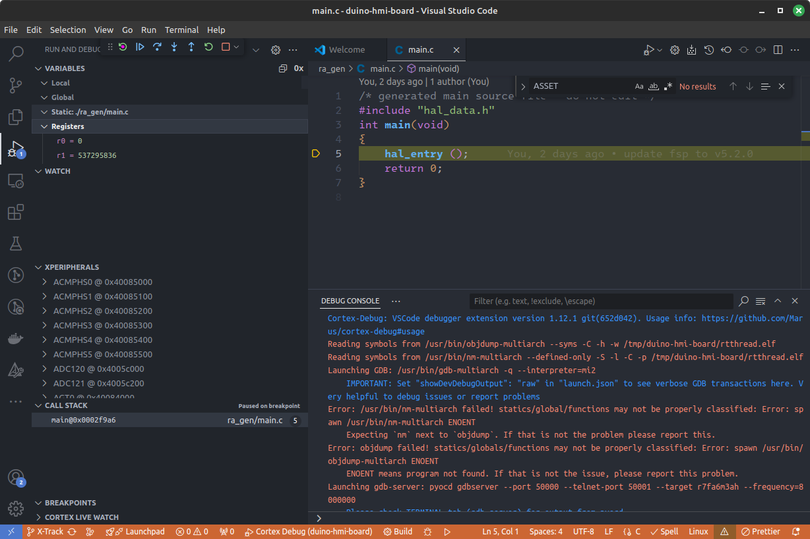
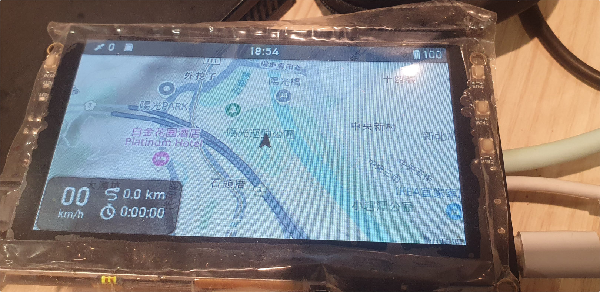

# X-Track with RT-Thread HMI Board

Migration [X-Track](https://github.com/FASTSHIFT/X-TRACK) to RT-Thread with RTduino

### Prerequisites
- [Hardware: RT-Thread HMI Board](https://rt-thread.medium.com/heads-up-rt-thread-renesas-lvgl-is-about-to-drop-a-cost-effective-hmi-board-30c55b676be3)
- [RTOS: RT-Thread v5.1.0](https://github.com/RT-Thread/rt-thread)
- [LVGL: v8.3.11](https://github.com/lvgl/lvgl)
- Build environment: Ubuntu 22.04 with arm-none-eabi-gcc toolchain and [Env tools of RT-Thread](https://github.com/RT-Thread/env)
### Build Steps

```bash
kunyi@host:.$ git clone https://github.com/KunYi/duino-hmi-board.git --single-branch --branch=X-Track # pull X-Track branch source code
Cloning into 'duino-hmi-board'...
remote: Enumerating objects: 6783, done.
remote: Counting objects: 100% (272/272), done.
remote: Compressing objects: 100% (201/201), done.
remote: Total 6783 (delta 109), reused 175 (delta 64), pack-reused 6511 (from 1)
Receiving objects: 100% (6783/6783), 62.16 MiB | 6.13 MiB/s, done.
Resolving deltas: 100% (1357/1357), done.
kunyi@host:./duino-hmi-board$ cd duino-hmi-board/
kunyi@host:./duino-hmi-board$ source ~/.env/env.sh # enabled Env tools of RT-Thread
kunyi@host:./duino-hmi-board$ scons -j12 # kick off build
scons: Reading SConscript files ...
Newlib version: 3.3.0
scons: done reading SConscript files.
scons: Building targets ...
CXX build/board/X-Track/App/App.o
CXX build/board/X-Track/App/Common/DataProc/DP_Clock.o
CXX build/board/X-Track/App/Common/DataProc/DP_GPS.o
CXX build/board/X-Track/App/Common/DataProc/DP_IMU.o
CXX build/board/X-Track/App/Common/DataProc/DP_MAG.o
...
remove build processing log
...
LINK rtthread.elf
Memory region         Used Size  Region Size  %age Used
ITCM:                     0 GB        0 GB
DTCM:                     0 GB        0 GB
FLASH:                806020 B        2 MB     38.43%
RAM:                 549160 B      640 KB     83.80%
DATA_FLASH:              0 GB       64 KB      0.00%
QSPI_FLASH:              0 GB       64 MB      0.00%
OSPI_DEVICE_0:           0 GB        0 GB
OSPI_DEVICE_1:           0 GB        0 GB
OSPI_DEVICE_0_RAM:       0 GB        0 GB
OSPI_DEVICE_1_RAM:       0 GB        0 GB
SDRAM:                   0 GB      128 MB      0.00%
OPTION_SETTING:          0 GB        0 GB
OPTION_SETTING_OFS:      0 GB       24 B       0.00%
OPTION_SETTING_SAS:      0 GB   18446744073709551564 B  0.00%
OPTION_SETTING_S:        0 GB        0 GB
ID_CODE:               16 B        16 B     100.00%
arm-none-eabi-objcopy -O ihex rtthread.elf rtthread.hex
arm-none-eabi-size rtthread.elf
text    data     bss     dec     hex    filename
802944   3092  546052  1352088
```

### Flash your RT-Thread HMI Board

Prerequisites:
- First, you need to install [PyOCD](https://github.com/pyocd/pyOCD)
- Second, you need to install [RA_DFP of Renesas](https://www.keil.arm.com/packs/ra_dfp-renesas/versions/) package

#### Check your PyOCD and Installed Packages

```bash
kunyi@host:./duino-hmi-board$ pyocd pack show
Pack Version
-----------------------------------
Cmsemicon.BAT32G133     1.1.5
Cmsemicon.BAT32G135-S   1.0.0
Cmsemicon.BAT32G135     1.0.1
Cmsemicon.BAT32G157-S   1.1.0
Renesas.RA_DFP          5.2.0
Keil.STM32F4xx_DFP      2.17.1
```

#### Run Flash Command

```bash
kunyi@host:./duino-hmi-board$ scons flash # flash your device
scons: Reading SConscript files ...
Newlib version: 3.3.0
scons: done reading SConscript files.
scons: Building targets ...
pyocd flash --frequency=8000000 --target r7fa6m3ah rtthread.hex
0001355 I Loading /tmp/duino-hmi-board/rtthread.hex [load_cmd]
[==================================================] 100%
0036903 I Erased 819200 bytes (31 sectors), programmed 803072 bytes (6274 pages), skipped 16 bytes (1 page) at 22.38 kB/s [loader]
scons: done building targets.
```

### VSCode/Cortex-Debug Debugging

Configuration is done in [./.vscode/launch.json](./.vscode/launch.json). You may need to modify it for your environment settings.



## Demo


---
### Video clip on Youtube
[](https://www.youtube.com/watch?v=3MoG6hRM5G0)
